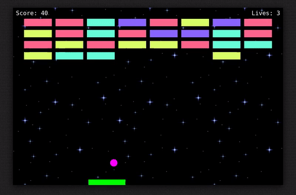

# DX-Ball Tiva-C

<h1 align="center">
  
</h1>


### TM4C123GH6PM  Microcontroller

A microcontroller is a compact integrated circuit designed to govern a specific operation in an embedded system. A typical microcontroller includes a processor, memory and input/output (I/O) peripherals on a single chip.


Overview. The Tiva C Series microcontrollers. provide a broad portfolio of floating- point enabled ARM Cortex-M4F. MCUs.


The Tiva™ C Series TM4C123G LaunchPad Evaluation Board (EK-TM4C123GXL) is a low-cost evaluation platform for ARM® Cortex™-M4F-based microcontrollers. The Tiva C Series LaunchPad also features programmable user buttons and an RGB LED for custom applications.


Arm Cortex-M4F
32-bit Arm Cortex-M4F based MCU with 80 -MHz, 256 -KB Flash, 32 -KB RAM, 2 CAN, RTC, USB, 64-Pin LQF.


Programmable timers can be used to count or time external events that drive the Timer input pins. The TM4C123GH6PM General-Purpose Timer Module (GPTM) contains six 16/32-bit GPTM blocks and six 32/64-bit Wide GPTM blocks.

Memory. 256 kb Flash memory. 32 kb single-cycle SRAM with internal ROM loaded with TivaWare software.


 
## Initialization of an I/O port
To initialize an I/O port for general use:

Activate the clock for the port in the Run Mode Clock Gating Control Register 2 (RCGC2).
Unlock the port (LOCK = 0x4C4F434B). This step is only needed for pins PC0-3, PD7 and PF0 on TM4C123GXL LaunchPad.
Disable the analog function of the pin in the Analog Mode Select register (AMSEL), because we want to use the pin for digital I/O. If this pin is connected to the ADC or analog comparator, its corresponding bit in AMSEL must be set as 1. In our case, this pin is used as digital I/O, so its corresponding bit must be set as 0.
Clear bits in the port control register (PCTL) to select regular digital function. Each GPIO pin needs four bits in its corresponding PCTL register. Not every pin can be configured to every alternative function.
Set its direction register (DIR). A DIR bit of 0 means input, and 1 means output.
Clear bits in the alternate Function Select register (AFSEL).
Enable digital port in the Digital Enable register (DEN).
Please note that we need to add a short delay between activating the clock and setting the port registers.
````c 
void PORTF_Init(void){  unsigned long volatile delay;
  SYSCTL_RCGC2_R |= 0x00000020;     // (a) activate clock for port F
  delay = SYSCTL_RCGC2_R;
  GPIO_PORTF_LOCK_R = 0x4C4F434B;   // unlock GPIO Port F
  GPIO_PORTF_CR_R = 0x11;           // allow changes to PF4-0  0001 0001
  GPIO_PORTF_DIR_R = 0x0E;          // 5) PF4,PF0 input, PF3,PF2,PF1 output      
 
  GPIO_PORTF_AFSEL_R &= ~0x11;       //     disable alt funct on PF4
  GPIO_PORTF_DEN_R = 0x1F;           // 7) enable digital pins PF4-PF0    6E from 1F       
  GPIO_PORTF_PCTL_R &= ~0x000F000F;  //  configure PF4 as GPIO
  GPIO_PORTF_AMSEL_R &= ~0x11;       //     disable analog functionality on PF4
  GPIO_PORTF_PUR_R |= 0x11;          //     enable weak pull-up on PF4
  GPIO_PORTF_IS_R &= ~0x11;         // (d) PF4,PF0 is edge-sensitive
  GPIO_PORTF_IBE_R &= ~0x11;        //     PF4,PF0 is not both edges
  GPIO_PORTF_IEV_R &= ~0x11;        //     PF4,PF0 falling edge event
  GPIO_PORTF_ICR_R = 0x11;          // (e) clear flags 4
  GPIO_PORTF_IM_R |= 0x11;         // (f) arm interrupt on PF4,PF0
  NVIC_PRI7_R = (NVIC_PRI7_R&0xFF00FFFF)|0x00400000; // (g) priority 2
  NVIC_EN0_R = 0x40000000;      // (h) enable interrupt 30 in NVIC
	EnableInterrupts();
}
````

#### Interrupt Handler
````c
void GPIOPortF_Handler(void){ // called on touch of either SW1 or SW2
  if(GPIO_PORTF_RIS_R&0x10){  // SW1 touch
			GPIO_PORTF_DATA_R &= 0x00;
			GPIO_PORTF_DATA_R |= 0x08;
    sw1flag = 0;  //flag to start the game
		if(playerXcord <63){
		  Nokia5110_PrintBMP(playerXcord, 47, space, 0);
			playerXcord+=4;
		}
		
		GPIO_PORTF_ICR_R = 0x10;  // acknowledge flag0
  }
  if(GPIO_PORTF_RIS_R&0x01){  // SW2 touch
			GPIO_PORTF_DATA_R &= 0x00;
		GPIO_PORTF_DATA_R = 0x02;
    
		
		if(playerXcord > 0){
		Nokia5110_PrintBMP(playerXcord+16, 47, space, 0);
			playerXcord-=4;
		}
		GPIO_PORTF_ICR_R = 0x01;  // acknowledge flag4
	}
	Nokia5110_PrintBMP(playerXcord, 47, PlayerShip0, 0);
		
}
````

#### Timer 
````c
void Timer2_Init(unsigned long period){ 
	
  unsigned long volatile delay;
  SYSCTL_RCGCTIMER_R |= 0x04;   // 0) activate timer2
  delay = SYSCTL_RCGCTIMER_R;
  Semaphore = 0;
  TIMER2_CTL_R = 0x00000000;    // 1) disable timer2A during setup
  TIMER2_CFG_R = 0x00000000;    // 2) configure for 32-bit mode
  TIMER2_TAMR_R = 0x00000002;   // 3) configure for periodic mode, default down-count settings
  TIMER2_TAILR_R = period-1;    // 4) reload value
  TIMER2_TAPR_R = 0;            // 5) bus clock resolution
  TIMER2_ICR_R = 0x00000001;    // 6) clear timer2A timeout flag
  TIMER2_IMR_R = 0x00000001;    // 7) arm timeout interrupt
  NVIC_PRI5_R = (NVIC_PRI5_R&0x00FFFFFF)|0x80000000; // 8) priority 4
// interrupts enabled in the main program after all devices initialized
// vector number 39, interrupt number 23    for timer2A   datasheet page 104
  NVIC_EN0_R = 1<<23;           // 9) enable IRQ 23 in NVIC  
  TIMER2_CTL_R = 0x00000001;    // 10) enable timer2A
}

void Timer2A_Handler(void){		
  TIMER2_ICR_R = 0x00000001;   // acknowledge timer2A timeout
  Semaphore = 1; // trigger
	timerflag = 0;
}
````

----
#
# DX-BALL
#### The hardware 
-	Breadboard
-	Tiva-C kit
-	Nokia 5110 blue screen
-	2 LEDs
-	2 switches
-	2 resistors
-	jumpers
#### The software
-	the game code runs with interrupt, timer and drivers 
-	the game has 3 levels with 3 life attempts


###  How code works ?
once the code runs the logo of DX-BALL will appear for 4 seconds using a one shot timer then it will ask you to press on switch 1 to start the game (using interrupt) . 
after pressing on switch one the game will start ,switch one moves the slider to the left and switch two moves it to the right (using interrupt) .
once pressing on each switch the led will be on .
we represent the food with 2-D array indicates the rows and columns of the food . when the position of the ball = position of the food the flag will be 0 and the food will disappear and the ball will change its direction.

when the ball hits the food , the food will disappear by printing space instead of it and the ball will change its direction based on its position, food position , screen borders.
The player has 3 life attempts ,3 levels to finish the game . after eating all the food he will move to the next level
Level one: the ball moves normally and the player has 4 rows of food to eat
Level two : the ball moves faster  and the player has 5 rows of food to eat
Level three : the ball moves faster and the player has 6 rows of food to eat
When all 3 attempts finish, it will print game over and calculate the score.

We used GPIO PORT F with 4 pins:
Pin0, pin4 as input for the two switches 
Pin1,pin3 as output for the two LEDs
For timer:
 we used timer A with 32 bit , one shot mode 
For interrupt:
we used edge sensitive, one edge , at falling edge
we detect the event (pressing on SW1 or SW2) with RIS register in Port F handler then it clears the interrupt flag using ICR register 


## usage
```` java 
git clone https://github.com/karim-moftah/DX-Ball-Tiva-C.git
download keil
biuld and run
````

## Control
````
Switch 1 for moving the slider to the right 
Switch 2 for moving the slider to the left
````

## Output

----

----

----

----

----


## Youtube Vedio

#### [Watch the video]


## Support

`Thanks to` 
- `Eng. Ahmed Bakr`
- `Eng. Mahmoud Nawar`
- `Dr. Ahmed Fares`

for thier support during this courses 


## Project Contributers:
| # | Name | Github link 
| ------ | ------ |--------|
| 1 | `Karim Moftah` | [karim-moftah]
| 2| `Abdelrahman Sayed` | [abdelrahman-Sayed-abdelhamid]
| 3 | `Mohammed Salah `|[mohamedsalah674]
| 4| `Mohammed Ahmed Ibrahim` |[mohamedmahfouz3]
| 5 |`Ammar Adel` |[ammaradel17]|
| 6 |`Abdalla Hamdy` |[Abdullahh74 ]


## Refernce
TM4C123GH6PM  Microcontroller Data sheet


   [karim-moftah]: <https://github.com/karim-moftah>
   [abdelrahman-Sayed-abdelhamid]: <https://github.com/abdelrahman-Sayed-abdelhamid>
   [mohamedsalah674]: <https://github.com/mohamedsalah674>
   [ammaradel17]: <https://github.com/ammaradel17>
   [mohamedmahfouz3]: <https://github.com/mohamedmahfouz3>
   [Abdullahh74 ]: <https://github.com/Abdullahh74>
   [Watch the video]:<https://www.youtube.com/watch?v=rZmfAq6zxSI>
